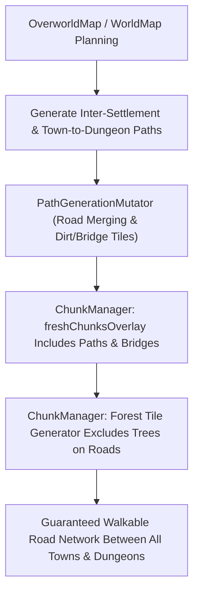

# Town-to-Dungeon Road Generation & Forest Clearing Design Spec

## Overview
This specification details the design for ensuring that clear, walkable roads and trails connect all settlements (cities, towns, villages) and dungeons across the overworld map, and that impassable forest (`TileType.Tree`) is permanently cleared along all roads and dungeon entrances.

---

## 1. Problem Definition
Currently, players navigating the overworld encounter sections of dense forest (`TileType.Tree`) blocking paths between towns and dungeons:
1. **Missing Town-to-Dungeon Road Links**: Overworld and regional path planning connected settlements to spawn, but lacked direct inter-settlement and settlement-to-dungeon road links.
2. **Chunk Generator Overwriting Paths**: In `ChunkManager.scala`, when new chunks are loaded, `freshChunksOverlay` merged `dungeons` and `villages` tiles but omitted `worldMap.paths` and `worldMap.bridges`. Consequently, forest biome chunk generation rendered `TileType.Tree` over existing road points.
3. **Forest Tile Generator Tree Scatter**: `ChunkManager`'s `OverworldTileType.Forest` handler randomly placed `TileType.Tree` 50% of the time even when `baseTile` was `TileType.Dirt`.

---

## 2. Architecture & Design Solution

### Component Details

#### A. Multi-Point Road Network Generation (`WorldMutator.scala` & `GlobalFeaturePlanner.scala`)
- **Path Destinations**: Collect all settlement entrances (cities, towns, villages), shop entrances, and dungeon approach tiles.
- **Star & Mesh Connections**:
  - Generate paths from player spawn to all destinations.
  - Connect each town/village entrance directly to its nearest dungeon approach tile and neighboring settlement nodes using `PathGenerator.generatePathAroundObstacles` with path merging (`existingPaths` discount 0.15).
- **Entrance Clearance**:
  - Enforce a 5x5 clearance zone (`TileType.Dirt` / `TileType.Floor`) around each dungeon entrance door and approach tile to ensure trees or rocks never block dungeon access.

#### B. Chunk Generation & Overlay Preservation (`ChunkManager.scala`)
- **Overlay Persistence (`freshChunksOverlay`)**:
  - Expand `structureTiles` in `freshChunksOverlay` to include `worldMap.paths` mapped to `TileType.Dirt` and `worldMap.bridges` mapped to `TileType.Bridge`.
  - When new chunks load, road and bridge tiles are preserved over base chunk terrain.
- **Tree-Free Road Rendering (`generateTilesForOverworldType`)**:
  - Check if `worldMap.paths` or `worldMap.bridges` contains `point`.
  - If `worldMap.bridges.contains(point)` -> return `TileType.Bridge`.
  - If `worldMap.paths.contains(point)` -> return `TileType.Dirt`.
  - In `OverworldTileType.Forest`, if `point` is on a road connection or path (`TileType.Dirt`), forbid placing `TileType.Tree`.

---

## 3. Verification & Testing Strategy
1. **Unit Tests**:
   - `TownDungeonRoadTest.scala`: Verify that every town and dungeon on the overworld map has a continuous path of walkable non-blocking tiles (`Dirt` / `Bridge` / `Floor`) between them across multiple random seeds.
   - `ForestRoadClearingTest.scala`: Verify that no `TileType.Tree` exists on any point in `worldMap.paths` or `worldMap.bridges` in any chunk.
2. **Integration Verification**:
   - Run full test suite (`sbt test`) ensuring all 150+ tests pass cleanly.

---

## 4. Execution Plan
1. Create design document at `docs/superpowers/specs/2026-08-06-town-dungeon-roads-and-forest-clearing-design.md`.
2. Create step-by-step TDD implementation plan at `docs/superpowers/plans/2026-08-06-town-dungeon-roads-and-forest-clearing.md`.
3. Implement tests and code changes across `ChunkManager.scala`, `WorldMutator.scala`, and `PathGenerator.scala`.
4. Verify all tests pass and commit to `main`.
