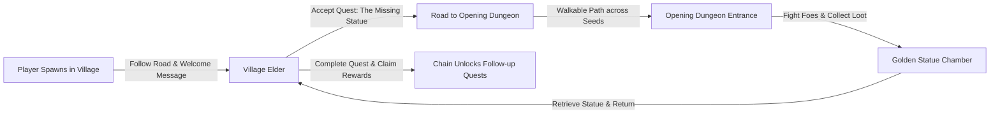

# Design Spec: Focused Initial Quest Flow

**Date**: 2026-08-12  
**Goal**: Ensure the game start is focused and quest-driven with a clear narrative and physical path connecting: Player Spawn -> Village Elder -> Opening Dungeon -> Retrieve Quest Item -> Complete Quest.

---

## 1. Overview & Narrative Arc

The game's opening sequence provides immediate direction, guiding the player from their starting location in the village to the Village Elder, along the road to the nearby cave dungeon, through rooms with engaging enemies and tactical items, to retrieve the stolen Golden Statue and return it to the Elder.

---

## 2. Component Specifications

### 2.1 Game Start Narrative & Messages
- **Starting Message Log**:
  When Adventure mode starts, `GameState.messages` is pre-populated with:
  `"Welcome to the village! Speak with the Village Elder nearby to begin your quest."`
- **Elder NPC Placement**:
  The Elder (`questGiver`) is placed in the generic village building closest to the player spawn point in the starting village.
- **Quest Marker Guidance**:
  - Before quest acceptance: WorldMap UI shows a distinct marker pointing to the Village Elder.
  - Active quest (item not found): WorldMap UI points to the Golden Statue inside the dungeon.
  - Active quest (item found): WorldMap UI points back to the Village Elder with a green completion marker.

### 2.2 Narrative Text Alignment
- **Elder Initial Dialogue**:
  `"Help! Thieves have stolen our sacred Golden Statue and fled into the cave dungeon to the east. Please travel along the road, defeat the creatures guarding it, and retrieve our statue!"`
- **Elder Dialogue (Active Quest)**:
  `"Please hurry! The Golden Statue is hidden inside the cave dungeon to the east."`
- **Elder Dialogue (Item Found / Completion)**:
  `"You found it! Thank you so much! Our village is safe once more."`
- **Quest Metadata (`data/Quests.scala`)**:
  - `id`: `"retrieve_statue"`
  - `title`: `"The Missing Statue"`
  - `description`: `"Follow the road to the cave dungeon to the east, defeat the enemies within, and retrieve the Golden Statue for the Village Elder."`
  - `readyToCompleteText`: `"You returned with the Golden Statue! The Village Elder is overjoyed."`
  - `completionText`: `"Thank you! You have restored peace to our village."`

### 2.3 Map Generation & Path Connectivity
- **Path Generation (`PathGenerationMutator`)**:
  - `playerSpawnPoint` -> `Elder's building entrance`.
  - `Elder's building entrance` -> `Opening Dungeon approach tile`.
  - `Opening Dungeon approach tile` -> `Dungeon entrance door`.
- **Accessibility Guarantee**:
  - Procedural road mutator guarantees a continuous, non-blocked, walkable path (dirt/bridge tiles) connecting the player spawn, Elder, and dungeon across all world seeds.
  - Obstacle avoidance prevents trees, walls, rocks, or water from severing the path.

### 2.4 Opening Dungeon Gameplay (Enemies & Items)
- **Enemy Progression**:
  - Early rooms (Depth 1-2): Slimelets and Rats (teaches basic movement & melee combat).
  - Mid rooms (Depth 3-4): Slimes and Snakes (teaches ranged ability dodging and positioning).
  - Statue Room (Final Depth): Guarded by a mixed enemy group (e.g. Slime & Snake guards).
- **Item Placements**:
  - Guaranteed tactical item drops (Healing Potions, Scrolls, Bow/Ammo, basic equipment upgrades) placed in dungeon rooms along the path to reward exploration before fighting the statue guards.

---

## 3. Verification & Testing Strategy

1. **Path Connectivity Unit & Integration Tests**:
   - Automated tests across multiple seeds verifying continuous walkable paths from `playerSpawn` -> `Elder` -> `Dungeon Entrance`.
2. **Quest Flow Edge Case & Completion Tests**:
   - Verify quest acceptance, item pickup, ready-to-complete state, dialogue transitions, and reward distribution.
3. **Full Test Suite Verification**:
   - Run `sbt test` ensuring all 161+ tests pass with zero regressions.
